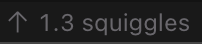

<h1 align="center">rsdd</h1>

<i>red-squiggle-driven-development</i>

> How copilot described it:
>
> _"A new way to develop software, based on the red squiggles in Visual Studio Code."_

## What is it for real?

  

A very simple VS Code extension that shows the number of "squiggles" (errors or warnings) you get while coding.

It's a joke, but it's also a real extension that you can install and use.

You'll get a status bar item that shows the **average number of squiggles per save**.

It will update on each save, and reset when you close the VS Code.
